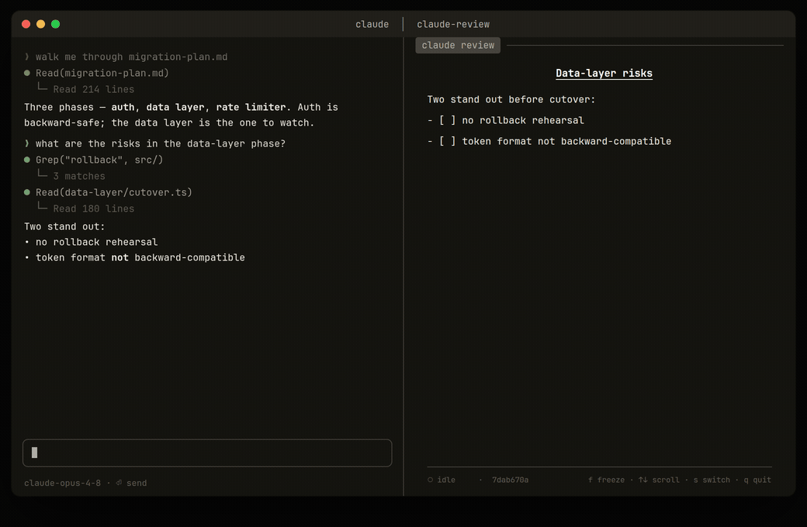

# claude-review


> **Faster than HTML. Calmer than the terminal.**

A read-only review pane for a single [Claude Code](https://claude.com/claude-code) session. It pins to one session and shows only its **latest response** — rendered as markdown, refreshed in place — so you read and decide in a calm second pane while you drive Claude Code in the first.



**Read-only and offline at runtime.** It only reads your local Claude Code transcript files — no writes, no network, no telemetry. It's a [single Python file](claude_review.py) with one dependency ([`rich`](https://github.com/Textualize/rich)), so you can read it before you run it.

## Quick start

Already using Claude Code? Install the skill and let Claude wire it up:

```bash
npx skills add r3al1tym/claude-review -g
```

Then just ask Claude *"open a review pane for this session"* — it resolves the session, installs the `claude-review` CLI if needed, and hands you the command to run in your other pane.

### Or install the CLI directly

```bash
pipx install git+https://github.com/r3al1tym/claude-review@v0.3.0
claude-review
```

Run Claude Code in one pane and `claude-review` in the other; it follows the latest response as Claude works. Requires Python 3.9+ and a POSIX terminal (Linux, macOS, WSL). Not on PyPI yet — install from GitHub with `pipx` (or a venv; a bare `pip install --user` may hit [PEP 668](https://peps.python.org/pep-0668/)).

## What it does

- **One session, pinned.** Pick the session you care about; the view never drifts to another.
- **Latest response only.** The current answer, rendered as clean markdown — re-anchored to the top each turn, never a scrolling log.
- **Surfaces.** `Tab` cycles `response`, `plan` (from plan mode), and `tasks` (the live task list).
- **Freeze.** Press `f` to hold the view while Claude keeps working; a marker shows when newer content is waiting.

> Claude Code's built-in [`/focus`](https://code.claude.com/docs/en/interactive-mode) declutters the *live* session in place; `claude-review` is the complement — a dedicated, scrollable reading pane alongside it.

## Usage

```bash
claude-review                 # pick a recent session, then review it
claude-review -s <id-prefix>  # attach directly to a session id
claude-review -p <path|slug>  # review another project (path or Claude slug)
claude-review -l              # list recent sessions and exit
claude-review --help          # all flags and keys
```

**Keys:** `Tab` surfaces · `y` copy the current surface · `f` freeze · `↑`/`↓` or `j`/`k` scroll (mouse wheel works too) · `space`/`b` page · `g`/`G` top/bottom · `s` switch session · `r` refresh · `q` quit.

**Reviewing another project:** run `claude-review` from the project directory, or pass `-p` an absolute path. If a lookup ever misses, run `ls ~/.claude/projects/` and pass the literal directory name with `-p`. If your `~/.claude` lives elsewhere, set `CLAUDE_CONFIG_DIR`. ([slug details](docs/troubleshooting.md))

To try the UI with no live session, a sample transcript ships in the repo: `claude-review -p "$PWD/examples"` (from a clone).

## How it works

`claude-review` reads the selected session's local JSONL transcript and reconstructs the current turn — the latest prompt and the response, plan, and tasks the assistant produced after it — re-reading only when the file changes. No network, ever.

## Limitations

- **Terminal-driven.** Needs an interactive TTY; it's a viewer, not a pipe.
- **Plan/tasks are best-effort.** They depend on Claude Code emitting the relevant transcript events.
- **No horizontal scroll.** Wide tables wrap to fit rather than scroll sideways.
- **Transcript format.** Parses Claude Code's current JSONL layout; a future format change may need a parser update — issues/PRs welcome.

## License

[MIT](LICENSE) © r3al1tym. The JetBrains Mono fonts under `demo/` (used only to render the GIF, not part of the installed package) are [SIL OFL 1.1](demo/OFL.txt).
